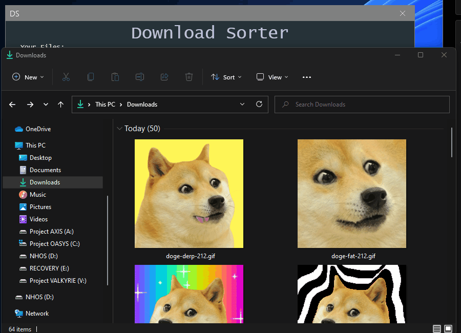

# DownloadSorter
Small Application to Sort my download folder with GUI and Async Mode

### Requirements:
* .Net Runtime >= 6.0 could also work with previous versions untested tho
* * Get at https://dotnet.microsoft.com/en-us/download/dotnet/6.0
* MahApps.Metro >= 2.4.9 could also work with previous versions untested tho
* * Get it through Nuget

### Known Issues:
* Async Mode cant be re-entered after deactivating.
* * Way to fix this is restarting the Application
